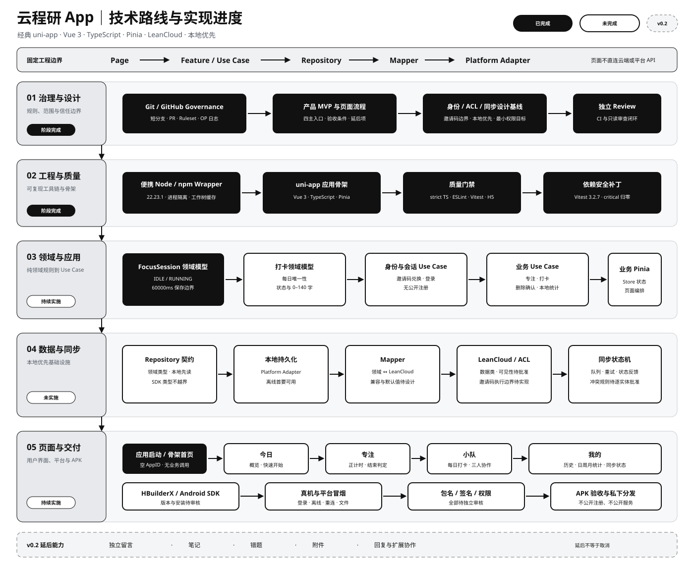

# 云程研 App

仓库：`Alioth-31/yuncheng-yan`

云程研是仅供三人使用的考研辅助 App，不开放注册，APK 只私下分发。仓库公开不代表账号、用户数据、配置或凭证公开。

## 当前状态

- `TASK-0101` 产品 MVP、`TASK-0301` 身份/ACL/同步设计基线、`TASK-0003` 工程骨架、`TASK-0004` Vitest 安全补丁与 `TASK-0401` 最小专注领域模型均已合并到 `main`。
- 当前工程骨架基于经典 uni-app（不是 uni-app x）、Vue 3、TypeScript 与 Pinia。
- 现有 `FocusSession` 最小专注领域模型已完成；骨架首页仍不含业务，专注页面、Use Case、Repository、LeanCloud、同步、Android 打包与真机流程尚未实现。
- LeanCloud 类/ACL、逐实体冲突规则、Android 包名、签名与 SDK 版本仍待批准。

## 技术路线与实现进度

[](docs/ROADMAP.md)

黑底白字 = 已完成，白底黑字 = 未完成，虚线灰色 = v0.2 延后。状态以 [`docs/ROADMAP.md`](docs/ROADMAP.md) 和已经合入 `main` 的事实为准。

## 固定架构边界

```text
Page -> Feature / Use Case -> Repository -> Mapper -> Platform Adapter
```

Page 不得直接调用 LeanCloud 或 `uni.*`；LeanCloud SDK 类型不得越过 Repository/Mapper；设备、文件、网络和本地存储能力必须通过 Platform Adapter。本地数据是首要可用来源，同步由基础设施负责。

## 固定工具链

- Node：`D:\node-v22.23.1-win-x64`，精确版本 `22.23.1`
- npm：精确版本 `10.9.8`
- Node 类型：精确版本 `@types/node@20.16.13`，与项目 TypeScript 4.9.5 及 Vitest/Vite 类型链实测兼容
- 项目入口：`scripts/Invoke-ProjectNode.ps1`
- npm 缓存：工作树内 `.npm-cache/`
- 模板：`dcloudio/uni-preset-vue` 提交 `6fb81ac3c5736b8b0a83e667b3ed90223d458dd8`

wrapper 只为其子进程前置固定 Node 和 `node_modules/.bin`，不修改 Machine/User PATH、注册表或 npm 持久配置。

## 安装与验证

在仓库根目录运行：

```powershell
powershell.exe -NoProfile -ExecutionPolicy Bypass -File .\scripts\Invoke-ProjectNode.ps1 -Tool npm ci
powershell.exe -NoProfile -ExecutionPolicy Bypass -File .\scripts\Invoke-ProjectNode.ps1 -Tool npm run check
powershell.exe -NoProfile -ExecutionPolicy Bypass -File .\scripts\Invoke-ProjectNode.ps1 -Tool npm run build:h5
powershell.exe -NoProfile -ExecutionPolicy Bypass -File .\scripts\Invoke-ProjectNode.Tests.ps1
powershell.exe -NoProfile -ExecutionPolicy Bypass -File .\scripts\Test-Governance.Tests.ps1
```

开发服务器可通过 wrapper 运行 `npm run dev:h5`。不要使用裸 `node`、`npm` 或 `npx` 执行本项目命令。

`npm run check` 会同时静态检查生产源码与 `src/**/*.spec.ts`，再执行 ESLint 和 Vitest。Vitest 已精确固定为 3.2.7；固定依赖树当前有 66 个 npm audit 项（0 critical、13 high），`--omit=dev` 后为 45 个（0 critical、11 high）。剩余 DCloud/Vite 依赖风险仍须由独立依赖治理任务按兼容 cohort 处理，不能使用自动修复或 broad overrides。

## 安全边界

真实 `.env`、MasterKey、token、Android 密码属性、签名材料、私钥、用户数据与 APK/AAB 不得进入仓库。`src/manifest.json` 的 AppID 为空，版本号仅为非发布占位；仓库不添加 LICENSE。
